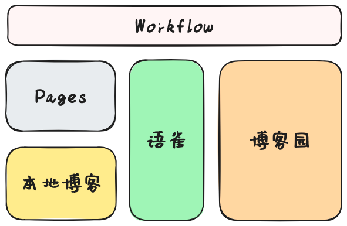
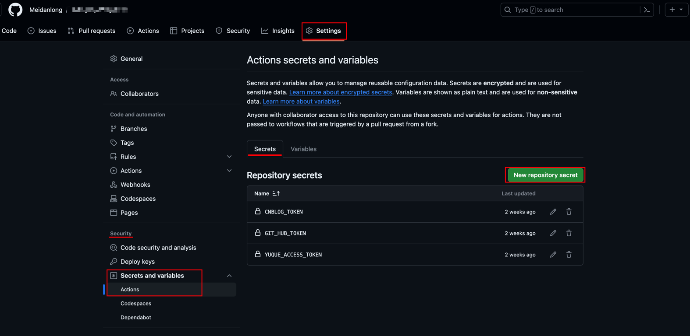

# 语雀文档同步个人博客及线上博客平台

以语雀文档为基础，同步个人git page博客和第三方线上博客平台（如：博客园）
## 一、背景
### 1、为什么选择语雀
1. 语雀是阿里旗下的博客编辑平台，提供长期稳定的技术支持
2. 具备多端App，可本地编辑，多种样式模块，操作简单快捷
3. 提供可靠的文件存储，减少自建文件服务器成本
### 2、语雀的痛点是什么
1. 语雀文档不支持博客个性化样式定制 --> _所以选择同步**个人博客**_
2. 语雀以个人或团队文档管理为主，网络流量和曝光量低 --> _所以选择同步**博客园**_

## 二、目标
1. 编辑语雀文档，公开的文档会自动定时同步个人博客和博客园
2. 删除或更改的文档也会同步进行更新
3. 提供开箱即用的基于hugo的FixIt主题的个人博客。如果已有博客，可直接提取项目中`sync`模块迁移至自有博客中，更改保存`博客目录(TARGET_DIR)`即可使用

## 三、项目
### 1、简介


如图所示，以语雀文档为核心，通过Github的工作流定时运行脚本代码，
将语雀文档分别与本地博客（准确地说应该是工作流服务器上的项目文件）和博客园的文档进行比对，对差异文件进行新增/更新/删除操作。
最后将更新好的问题文件推送远端个人博客和博客园。

### 2、里程碑
<details><summary>FEB：个人博客优化</summary>
<pre>
<code>
[ ] 个人博客适配 
[ ] 编译后的代码，远程推送pages制定仓库
</code>
</pre>
</details>
<details><summary>JAN：基础功能完成</summary>
<pre>
<code>
[X] Github API接入 </br>
[X] 语雀 API接入 </br>
[X] 博客园 API接入 </br>
[X] 博客文本内容解析 </br>
[X] 同步模块完成
</code>
</pre>
</details>

## 四、快速使用
### 1、fork 项目
`fork`本项目，并将项目`clone`到本地
```shell
git clone --recurse-submodules <repository-url>
```

### 2、添加密钥

#### 2.1、密钥获取
我们要获取以下三个密钥：
##### a、CNBLOG_TOKEN：博客园密钥

##### b、GIT_HUB_TOKEN：Github密钥

##### c、YUQUE_ACCESS_TOKEN：语雀密钥

#### 2.2、密钥添加
因为密钥在开源项目中是非常不安全的，我们可以利用Github的密钥管理功能代为存储。

配置方式：`个人仓库` -- `Settings` -- `Security` -- `Screts and variables` -- `Action` -- `New repository secret`



### 3、更改配置
需要根据自己的信息同步个人配置，更改`@/sync/domain/constant/private_data`文件

```python
# 博客园用户名
CNBLOG_USERNAME = ''
# 博客metaweblog api地址
CNBLOG_METAWEBLOG_API = ''

# Github存储文档的仓库及分支
REPO_NAME = ''
REPO_BRANCH = ""
# Github Pages发布对应仓库及分支
PAGES_REPO_NAME = ''
PAGES_REPO_BRANCH = ""

# 语雀知识库中，被排除的知识库列表。为空则获取全部知识库
EXCLUDE_BOOKS = []
```

### 4、打开workflow
在`@/.github/workflows/sync-job.yml`中取消注释定时任务代码

```yaml
on:
  schedule:
    - cron: "0 10 * * *"
```

### 5、推送代码
```shell
git add .
git commit -m "init"
git push --set-upstream origin master
```

至此，项目基本配置已经完成，等待下一次的定时任务完成就可以将语雀文档同步到个人博客和博客园啦～